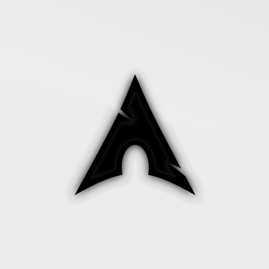

<h1 align="center">🕷️ AzureNightlock 🕷️</h1>

  

### **AI/ML focused - Stoic and Lucid**
####  ➤  🛠 **Stack:** Building with **Python**, **FastAPI**, and **Next.js**.
####  ➤  🚀 **Current Focus:** Developing **Anzan Trainer** (Mental calculation mastery).
####  ➤ ♟️ **Pursuits:** Piano & Chess - Discipline, Consistency and Precision.

---

---

<table>
<tr>
  <td align="center" width="120" style="border:1px solid #2a2a2a;border-radius:14px;padding:12px;">
    
     <b>Next JS</b>
  </td>

  <td align="center" width="120" style="border:1px solid #2a2a2a;border-radius:14px;padding:12px;">
    
     <b>Tailwind</b>
  </td>

  <td align="center" width="120" style="border:1px solid #2a2a2a;border-radius:14px;padding:12px;">
    
     <b>Python</b>
  </td>

  <td align="center" width="120" style="border:1px solid #2a2a2a;border-radius:14px;padding:12px;">
    
     <b>FastAPI</b>
  </td>

  <td align="center" width="120" style="border:1px solid #2a2a2a;border-radius:14px;padding:12px;">
    
     <b>Postgres</b>
  </td>
</tr>
</table>

---

### 🌐 Web Development 🌐
<table>
<tr>
  <td align="center" width="120" style="border:1px solid #2a2a2a;border-radius:14px;padding:12px;">
    
     <b>HTML</b>
  </td>

  <td align="center" width="120" style="border:1px solid #2a2a2a;border-radius:14px;padding:12px;">
    
     <b>CSS</b>
  </td>

  <td align="center" width="120" style="border:1px solid #2a2a2a;border-radius:14px;padding:12px;">
    
     <b>JavaScript</b>
  </td>

  <td align="center" width="120" style="border:1px solid #2a2a2a;border-radius:14px;padding:12px;">
    
     <b>TypeScript</b>
  </td>

  <td align="center" width="120" style="border:1px solid #2a2a2a;border-radius:14px;padding:12px;">
    
     <b>React</b>
  </td>

  <td align="center" width="120" style="border:1px solid #2a2a2a;border-radius:14px;padding:12px;">
    
     <b>Flask</b>
  </td>
</tr>
</table>

### 🤖 Machine Learning 🤖
<table>
<tr>
  <td align="center" width="120" style="border:1px solid #2a2a2a;border-radius:14px;padding:12px;">
    
     <b>NumPy</b>
  </td>

  <td align="center" width="120" style="border:1px solid #2a2a2a;border-radius:14px;padding:12px;">
    
     <b>Matplotlib</b>
  </td>

  <td align="center" width="120" style="border:1px solid #2a2a2a;border-radius:14px;padding:12px;">
    
     <b>Pandas</b>
  </td>

  <td align="center" width="120" style="border:1px solid #2a2a2a;border-radius:14px;padding:12px;">
    
     <b>PyTorch</b>
  </td>
</tr>
</table>

### 🛢️ Databases 🛢️
<table>
<tr>
  <td align="center" width="120" style="border:1px solid #2a2a2a;border-radius:14px;padding:12px;">
    
     <b>PostgreSQL</b>
  </td>

  <td align="center" width="120" style="border:1px solid #2a2a2a;border-radius:14px;padding:12px;">
    
     <b>MongoDB</b>
  </td>
</tr>
</table>

### 🛠 Other Tools 🛠
<table>
<tr>
  <td align="center" width="120" style="border:1px solid #2a2a2a;border-radius:14px;padding:12px;">
    
     <b>Git</b>
  </td>
  <td align="center" width="120" style="border:1px solid #2a2a2a;border-radius:14px;padding:12px;">
    
     <b>GitHub</b>
  </td>

  <td align="center" width="120" style="border:1px solid #2a2a2a;border-radius:14px;padding:12px;">
    
     <b>Docker</b>
  </td>

  <td align="center" width="120" style="border:1px solid #2a2a2a;border-radius:14px;padding:12px;">
    
     <b>Kubernetes</b>
  </td>
</tr>
</table>

---

<table>
  <tr>
    <td align="center">
      
    </td>
    <td align="center">
      
    </td>
  </tr>
  <tr>
    <td colspan="2" align="center">
      
    </td>
  </tr>
  <tr>
    <td colspan="2" align="center">
       
      
        
      
    </td>
  </tr>
</table>

---

<picture>
  <source media="(prefers-color-scheme: dark)" srcset="https://raw.githubusercontent.com/AzureNightlock/AzureNightlock/output/github-snake-dark.svg" />
  <source media="(prefers-color-scheme: light)" srcset="https://raw.githubusercontent.com/AzureNightlock/AzureNightlock/output/github-snake.svg" />
  
</picture>

---

